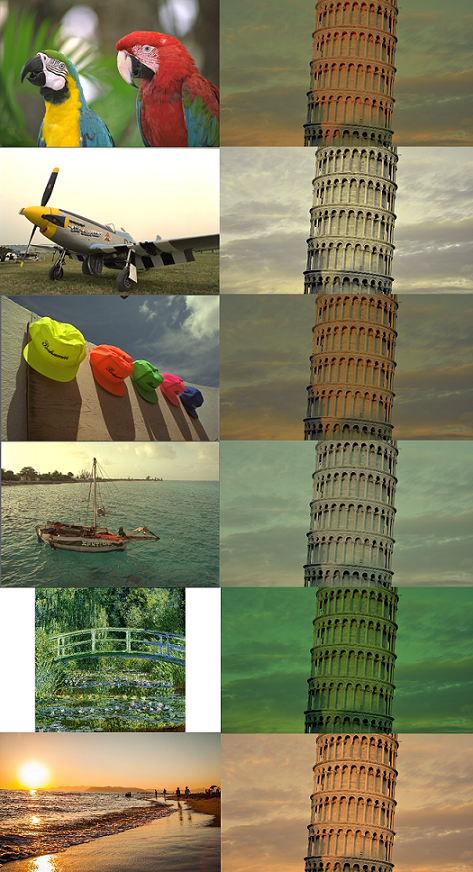

# Color Transfer between Images

Color Transfer is a simple but effective algorithm to transfer image color styles, which is proposed by Reinhard et al., 2001.

The core idea is to adjust the means and standard deviations of the color values of the source image to be consistent with that of the target image in ℓαβ color space.

Some examples are shown as follows.

**Source**

**Targets** and **Outputs**

    

# Requirements

- NumPy
- Matplotlib

# Note

In some implementations, `cv2.cvtColor()` and `cv2.COLOR_BGR2LAB` are used to simplify the color space conversion. This does works, but be aware that `OpenCV` has additionally done a rescale here to remap the channel values to be in [0, 255], instead of keeping the original ℓαβ channel values.

# References

- E. Reinhard, M. Adhikhmin, B. Gooch and P. Shirley, "Color transfer between images," in IEEE Computer Graphics and Applications, vol. 21, no. 5, pp. 34-41, July-Aug. 2001, doi: 10.1109/38.946629.
- [jrosebr1/color_transfer](https://github.com/jrosebr1/color_transfer)
- [chia56028/Color-Transfer-between-Images](https://github.com/chia56028/Color-Transfer-between-Images)
- [色彩空间转换（RGB空间与Lab空间）](https://blog.csdn.net/qq_38701868/article/details/89433038)